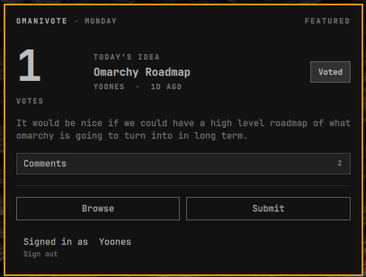

# Omani Vote



A daily board for Omarchy ideas. Submit a feature or a fix, upvote what you want next, and leave a comment. Each day, one idea is featured on the first screen.

Browse is public. Voting, commenting, and submitting need an Omani Vote account.

## Install

```sh
omarchy plugin add https://github.com/yooneskh/omani-vote.git --enable
```

## Usage

Click the ✦ teaser to open today's featured idea.

- **Browse** — sort by Hot, New, or Top
- **Submit** — share a new idea
- **Sign in** — or register if you do not have an account yet

Keyboard: `j` / `k` move, Enter open, `v` vote, `n` new idea, Escape back or close.

## Remove

```sh
omarchy plugin remove yooneskh.omani-vote
```
